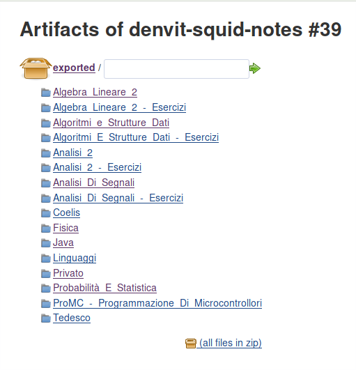
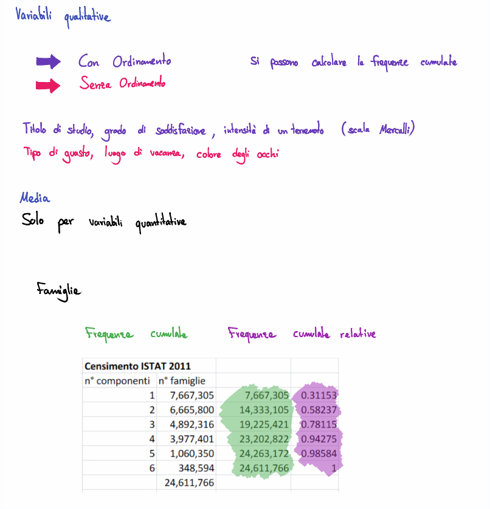
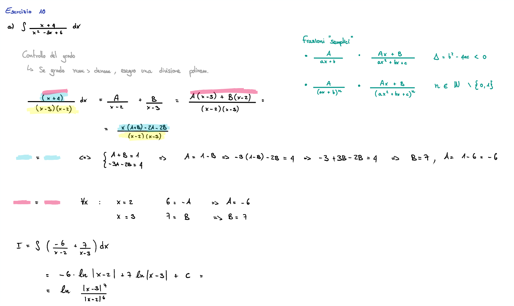
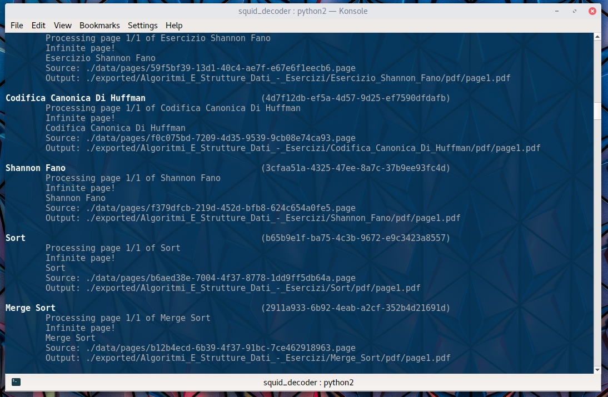

# Squid Decoder

**REQUIRES PYTHON 2**  
*cairoffi doesn't seem to work with Python 3*

[Haxelion](https://github.com/haxelion/) reversed engineered part of [Squid (ex Papyrus) application](http://squidnotes.com/) page storage
format which is based on [Google Protocol Buffers](https://developers.google.com/protocol-buffers/).
He rewrote part of the format `.proto` file and wrote a demonstration script which uses protobuf and
cairo to convert Squid page file into SVG.

[I](https://github.com/denysvitali/) have extended his work adding more features
like Ellipses, Text support and notes export based on the `papyrus.db` file.

## Screenshots
### Output
With *Squid Decoder* you can convert your `papyrus.bak` file into a collection of converted PDF files.  
If you're geek enough (like myself), you can even set up a CI and
generate the PDFs remotely:
#### Artifacts dir
This is how the directory will look like after you run *Squid Decoder* on your `papyrus.bak` file. Your notes will be divided into folders that have the same name of the notebook that contiains them.  



#### Example 1
Multi-colored path, highlights, shapes, you name it! *Squid Decoder* has your back. We (almost) have a 1:1 conversion. WYS (in Squid app) IWYG.


#### Example 2


## Process
During the process, you'll be able to see what notes are being converted, and where they are going to be placed.  
After the process terminates, you'll be able to browse your `exported/` folder and enjoy your PDF files.  


## Background

You can obtain those pages by making a local or cloud backup. This creates a file called
`papyrus.bak` which is in fact a zip file. In the zip you'll find an `info.json` file, a
`papyrus.db` database file and a `data` directory. The pages are located in `data/pages`.

Page names correspond to UUIDs. The database (which is a SQLite3 database) links those UUID with
notes and notebooks.

From a limited reverse engineering of the application you can discover it uses the
[Wire Protocol Buffer](https://github.com/square/wire) to generate java files from Google Protocol
Buffers definition of the Squid Page format. I thus simply reconstructed the `.proto` file from
those reversed java files.

## Limitations

Only the stroke part of the format (which is also used by the rectangle and line tools) is fully
reversed because so far that's the only part I care about. The following features are not reversed
engineered:

* Paper background
* ~~PDF background~~
* ~~Ellipse tool~~
* ~~Text tool~~
* ~~Image tool~~

Feel free to open an issue if you need it and encourage me to reverse engineer it. Or send a pull request if you've implemented it.

## Installation
```
pip install cairocffi protobuf pypdf pillow
```

## Usage

Place your papyrus.bak in the project folder, then do:
```
unzip papyrus.bak
python2 papyrus.py
```

You can now enjoy your notes in .svg format, well organized, in the newly created `exports/` folder


### Jenkins Build
If you have access to a Jenkins instance, and can create your own jobs, setting up a job for the PDF generation may be very useful.  
To do so, go to the Jenkins instance page and create a job, add this repo to the build, then in "Build" add "Execute Shell" with the following
```
#!/bin/bash
source ~/.bashrc
echo "Environment variables for $USER:"
env

wget 'https://dropbox.com/your-file/papyrus.bak' -O papyrus.bak
unzip papyrus.bak || true

pip install cairocffi protobuf pypdf
python2 papyrus.py
```

If you get an ascii error, go to "Manage Jenkins", then click "Configure" and add the `LC_ALL=en_US.UTF-8` environment variable (maybe you need to add `LANG=en_US.UTF-8` too).
## Tool Usage

The `page2svg.py` tool can be simply used with the following command:

```
python2 page2svg.py <Input Squid page file> <Output SVG>
```

`page2svg.py` is supposed to demonstrate how you can interpret the Squid Page format.

## Disclaimer

I made this work under the fair assumption it is covered by the exceptions of the section 1201 of
the Digital Millennium Copyright Act: https://www.eff.org/fr/issues/coders/reverse-engineering-faq#faq9
